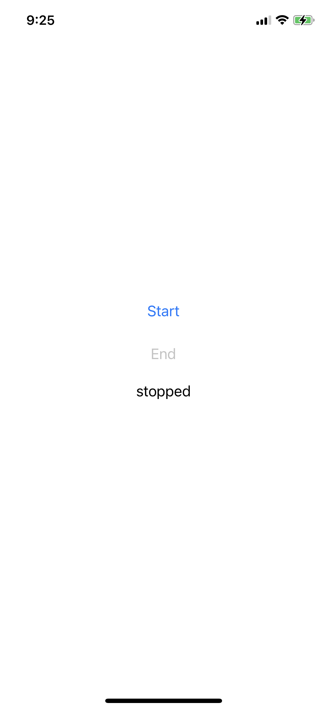
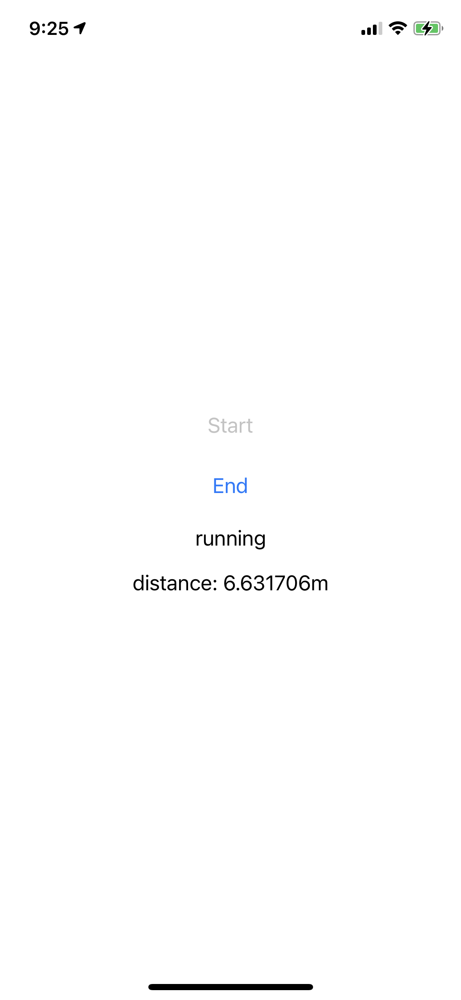

# Welcome

This is intended to be a simple project to help us get to know your experience with iOS development. The goal is to create a basic single screen vanpool application that allows you to do the following:
 
* Start a trip if one is not active.
* Stop a trip if one is active.
* Observe whether or not you have an active trip or not.
* Observe the cumulative distance you have traveled on an active trip (this will require you to track the device's GPS location).

Do not spend extra time satisfying use cases other than these. Keep it simple and fun - if you feel compelled to spend a little extra time on this, then focus on the UI, not the corner cases of a vanpool trip lifecycle.

The goal of this exercise is not to create a production quality application, but rather to see if you can utilize basic iOS APIs like UIKit and CoreLocation. Feel free to create a `Trip` type, but keep UI code to the provided `ViewController` class. Programmatic UIKit must be used, do not use SwiftUI, Storyboards, or Interface Builder. We have created a `UIStackView` in `ViewController` to get you started. If you prefer to start with a different root view, feel free to do so.

The hope is that this will take you 1-2 hours, but the actual time may be slightly more or less, depending on your familiarity with some APIs. We expect that most people will have to consult some Apple documentation to complete this exercise.

Functionality that we are not looking for:

* Tracking passengers
* Tracking multiple trips
* Remembering or viewing past trips
* Persistence
* Networking
* Gracefully handling background modes, app restarts, etc.
* Localization

However, give the items above some thought and perhaps we can discuss potential approaches in a follow up discussion.

To get started:

* Clone this repository to your local machine. Please do NOT fork it on GitHub.
* You will need Xcode installed to open the project.

When you finish, compress the repository into a zip file or tarball, and send it back to us.

Following are two screenshots of a simple implementation I created. All my code was in `ViewController`, and was about 150 lines. The first screenshot was taken with no active trip. The second screenshot was taken with a trip in progress.

